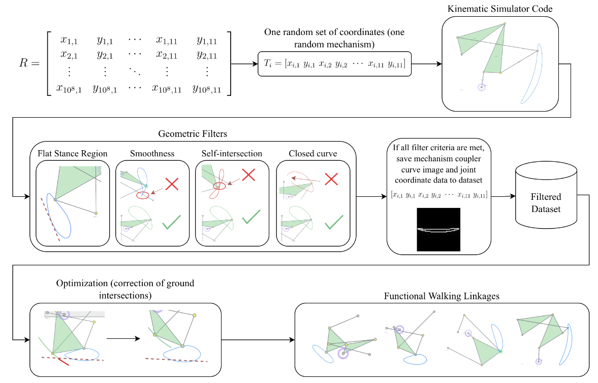

<br/>
<div align="center">
<a href="h[ttps://github.com/ShaanCoding/makeread.me](https://github.com/Ray0716/teenhacks-2025)">
 
</a>
<h1 align="center">Kinematic Synthesis of Planar Walking Mechanisms through
Large-Scale Dataset Generation, Geometric Filtering, and
Optimization</h3>
<p align="center">
Github repository for research project conducted at Stony Brook University through the Simons Summer Program Fellowship. 

<br/>
<br/>
<a href="https://google"><strong>Explore demo (coming soon) »</strong></a>
<br/>
<br/>

</p>
</div>


<div align="center">
  


  

</div>

## Table of Contents

- [Table of Contents](#table-of-contents)
- [About The Project](#about-the-project)
  - [Built With](#built-with)
- [Getting Started](#getting-started)
  - [Prerequisites](#prerequisites)
  - [Installation](#installation)
  - [Features](#features)
  - [Notes](#notes)
- [Roadmap](#roadmap)
- [Contributing](#contributing)
- [License](#license)
- [Contact](#contact)
- [Acknowledgments](#acknowledgments)

## About The Project



text


### Built With

This project was built with the following technologies:

* Python
* pyautogui
* opencv
* mediapipe

## Getting Started

Below are instructions on how to run this project locally.


### Installation

Please follow the following steps for successful installation:

1. **Clone the Repository:** Get started by cloning the repository to your local machine.

   ```
   https://github.com/Ray0716/teenhacks-2025
   ```


## Contact

If you have any questions or suggestions, feel free to reach out to us:
